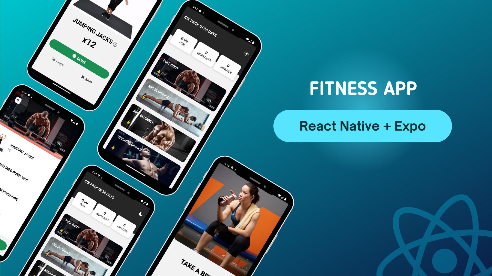

# Fitness Mobile App



## Frontend

The clients in this project will interact with our service using a mobile app.It is a basic fitness application built with React Native and Expo. It provides a starting point for developers who want to create a fitness tracking or workout guidance app.

### Features - *frontend*

- Built with React Native for cross-platform development (iOS & Android)
- Leverages Expo for streamlined development workflow

### Getting Started - *frontend*

- Clone this repository.

```sh
git clone https://github.com/eugenesang/fitness_mobile.git
```

- Go to frontend

```sh
cd fitness_mobile/app
```

- Install dependencies:

```sh
npm install
```

- Install Expo app to your phone
  - [Android](https://play.google.com/store/apps/details?id=host.exp.exponent&pcampaignid=web_share)
  - [IOS](https://apps.apple.com/us/app/expo-go/id982107779)

- Run the app

```sh
npm start
```

- Switch to run **expo go**
- Open the expo app in your phone.
- Scan the QR code

or

- Run the app in development mode:  (Opens in Expo app)
  - iOS

  ```sh
  npm run ios
  ```

  - Android
  
  ```sh
  npm run android
  ```

### Customization - *frontend*

This app serves as a foundation. Feel free to customize it by:

- Adding new exercise data and categories
- Implementing workout routines and tracking
- Integrating fitness data access (requires additional libraries)
- Designing a custom user interface

### Libraries - *frontend*

- [React Native](https://reactnative.dev/)
- [Expo](https://expo.dev/)

### Further Resources:

- **React Native Fitness Libraries:** Explore libraries like react-native-fitness or react-native-health for fitness data access on mobile devices.
- **Expo Documentation:** Refer to Expo's documentation for in-depth guides on development, building, and deployment.
